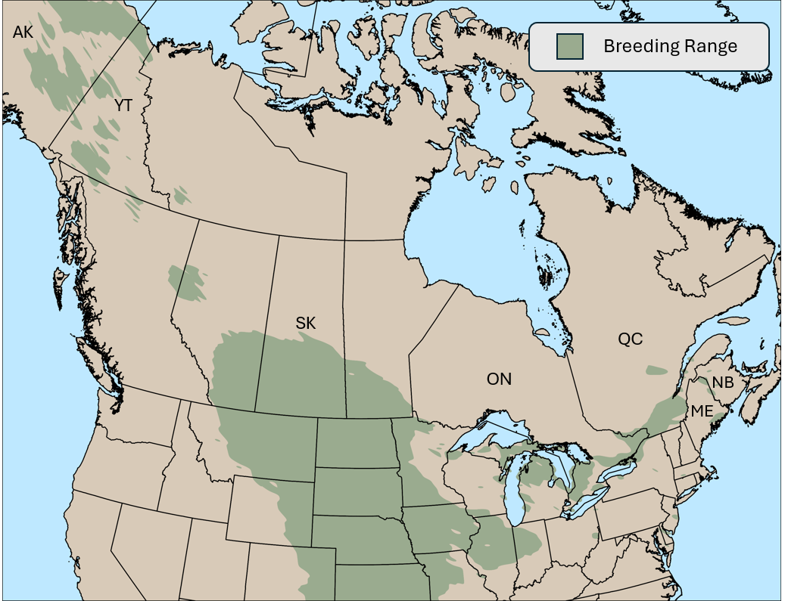
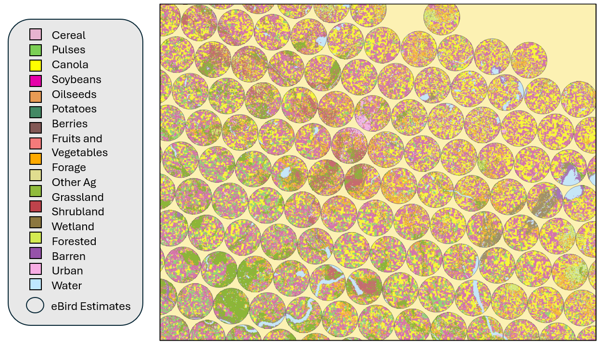
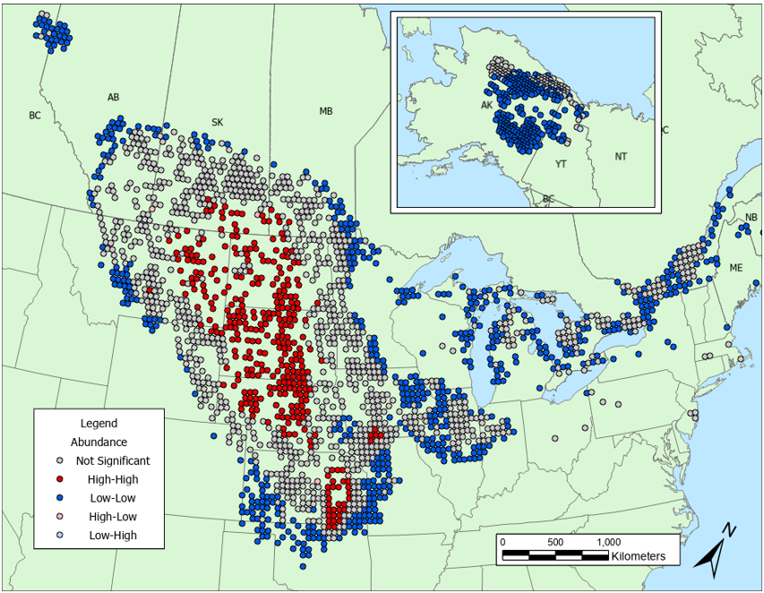

Andres N. Rosales

M.Sc. Candidate, University of Saskatchewan, Department of Biology 

Fall 2024

# The Upland Sandpiper

 The Upland Sandpiper (Bartramia longicauda) stands as an ode to the beauty and ecological significance of prairies and great plains of North America. A non-typical shorebird, inhabiting grasslands, rather than beaches, during the summers in North America. Characterized by their elongated neck, tall yellow legs, and distinctive 'wolf whistle' call they're typically observed standing on fence posts. While a common observance for birders in the prairies, many have had a more difficult pursuit, especially in regions of imperil. 

 During the breeding season, Upland Sandpipers encounter numerous threats linked to agricultural intensification and limited landscape diversity. The widespread conversion of rangelands to intensive row-cropping, particularly prevalent in the Great Plain and Prairie Pothole regions, poses a potential challenge for grassland shorebirds and may contribute to these species’ reliance to agriculture landscapes. These agriculturally intense areas are characterized by simplified landscapes, heightened pesticide use, and reduced ecosystem services almost serving as an ecological trap! While species use of agricultural landscapes has been extensively researched in passerine and gallinaceous birds, information on the impact of agriculture on grassland shorebirds, and the Upland Sandpiper, is lacking. Enhancing our understanding of how agricultural practices impact Upland Sandpiper, and other vulnerable grassland birds, is essential for developing effective management and conservation strategies in Saskatchewan’s agriculturally dominated landscapes.
 
 

# Project Objectives
Understanding agricultural factors influencing population trends is crucial for effective future conservation efforts for Upland Sandpiper. Landscape level factors, such as the composition and heterogeneity of agricultural lands are suspected to play a role in Upland Sandpiper population trends and their distribution across the landscape. Examining the impact of agriculture on population trends provides a better understanding of the variable threats this species encounters throughout their breeding range.

# Datasets 
## Community Science
  Evaluating avian status and trends is an ongoing effort for wildlife managers and conservation practitioners. Beginning as early as 1966, the [Breeding Bird Survey](https://www.canada.ca/en/environment-climate-change/services/bird-surveys/landbird/north-american-breeding/overview.html) (commonly refer to as BBS) was the most intuitive way to measure broad scale changes in avian populations. This effort involves many volunteers across North America following a structured survey recording any and all bird observation. Using these data to evaluate status and trends, however, is challenging, and only provides broad scale patterns of population dynamics (province or country level).
  
  A recent, popular citizen science platform, [eBird](https://ebird.org/home) follows a similar semi-structured survey effort and includes observations across North America. [eBird Status and Trends](https://science.ebird.org/en/status-and-trends/species/uplsan/trends-map) is a recent product developed from the eBird team at Cornell University. Status and Trends reports seasonal abundance and the trend of that abundance over 11 years! Their method involves complex modeling and machine learning, accounting for confounding factors such as observer effects, environmental variables, and may others.
  
  For this project, I will use trend estimates for the Upland Sandpiper from eBird Status and Trends, during the breeding season. Trends are representative of 27km areas with information of the yearly abundance, trend in abundance, and 80% confidence intervals for each estimate.
  
  

## Land-cover classifications
To be able to identify the characteristics of each landscape where trends are estimated within, we need fine scale information on the types of land cover where population dynamics are operating. To accomplish this, we can use the Agriculture and Agri-Food Canada (AAFC) [Annual Crop Inventory (ACI)](https://www.agr.gc.ca/atlas/apps/aef/main/index_en.html?AGRIAPP=23). This data set classified major land cover types in Canada, with a focus on differentiating crop types (e.g., canola, wheat, pulses, etc.). 

# Preliminary Results

 The comprehensive analyses for this chapter are still in progress. A final dataset has been compiled for an analysis of Upland Sandpiper trends in the Canadian prairies, allowing for initial exploratory analysis to be conducted. To assess spatial dependence of eBird trend pixels, I calculated and visualized Moran’s I for the spatial trends (Figure 1 and 2). This analysis confirms the presence of spatial autocorrelation in the estimates and reveals patterns in Upland Sandpiper population dynamics on the breeding grounds. Figure 1 illustrates areas of high abundance near similar areas of high abundance, highlighting  regions with high densities of the species. Figure 2 effectively illustrates the regional variation in population trends. These results indicates that Upland Sandpiper populations are increasing throughout majority of their range in Saskatchewan, Alberta, and Manitoba. Localized increases in the Great Plains of the U.S. suggest the possibility of a range contraction or northward range shift of the species. It’s important to note that these results are exploratory, and further robust statistical analysis are needed to draw sounds conclusions. Future analysis will focus on building candidate models with my predictor variables to answer the contraction hypothesis and the effect of agriculture activity on Upland Sandpiper. 
 
 

  <figure style="text-align: center;">
    
    <figcaption>Figure 2. High abundance estimates (red) near similar high abundance estimates.</figcaption>
  </figure>
  <figure style="text-align: center;">
    
    <figcaption>Figure 1. Increasing trend estimates (red) near similar trend estimates</figcaption>
  </figure>

# Discussion

In North America, the intensification of agriculture is widespread, posing many challenges to natural areas and those charged with managing them. Intensification of agriculture and a growing dependence on agrochemicals, to ensure a productive yield, has become a prevailing global phenomenon. Simplification of landscapes in agricultural regions of Canada has increased over the last two decades and is associated with larger field sizes, crops associated with higher agrochemical applications, and reduced landscape heterogeneity. In the United States, while total area devoted towards cropland is declining, agricultural systems have progressively transitioned to specialized farm consolidations and the homogenization of crop production. Additionally, Policies in northern regions of Canada and the United States support agricultural expansion through financial support and conversion of natural areas to agriculture, as food security in these regions is increasingly threatened. Agricultural intensification presents a complex challenge. While commodity cropping is important for ensuring food security, it often comes at an expense to ecosystem and wildlife health. Addressing this requires collaboration from conservationist, producers, and policy makers to ensure effective management and conservation of species, like the Upland Sandpiper, in these human-dominated landscapes.

